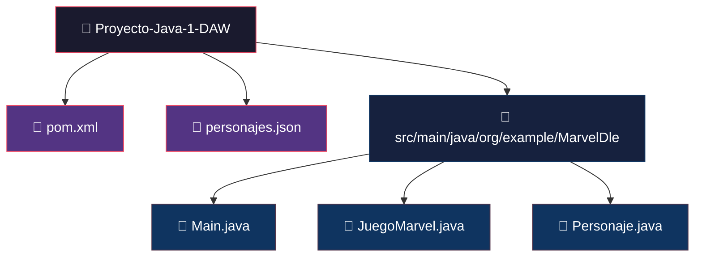
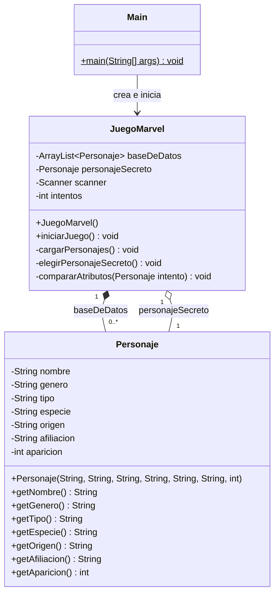
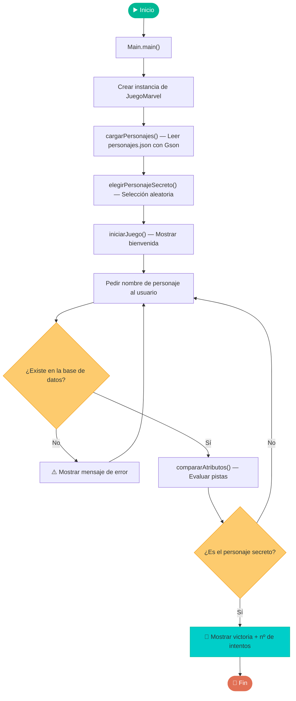
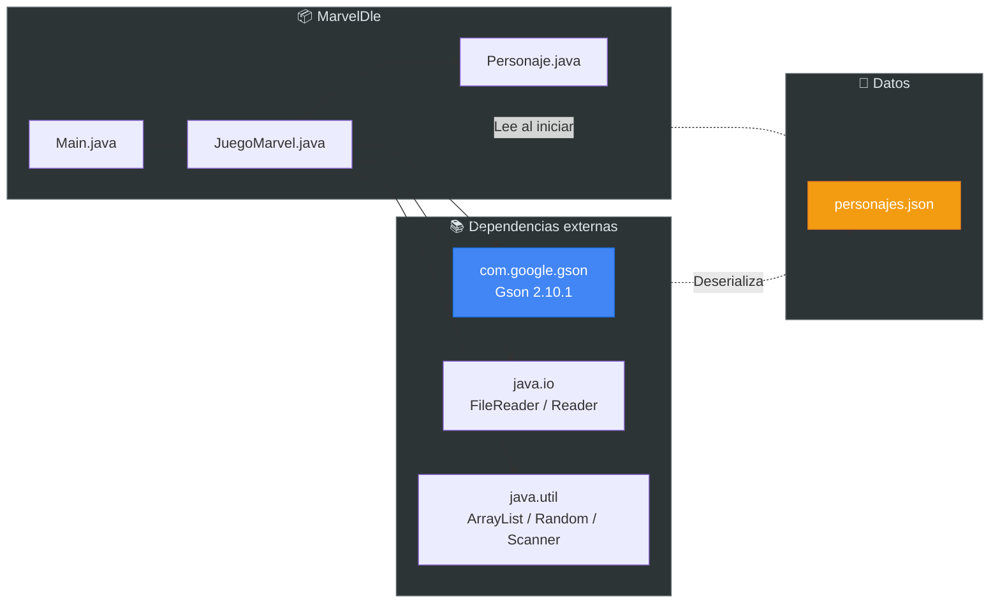
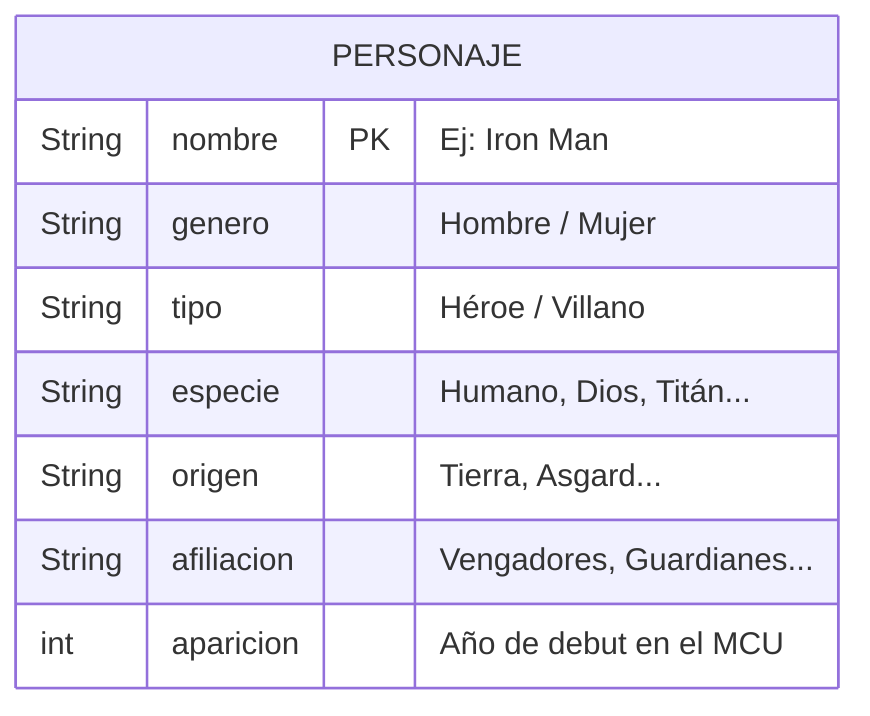
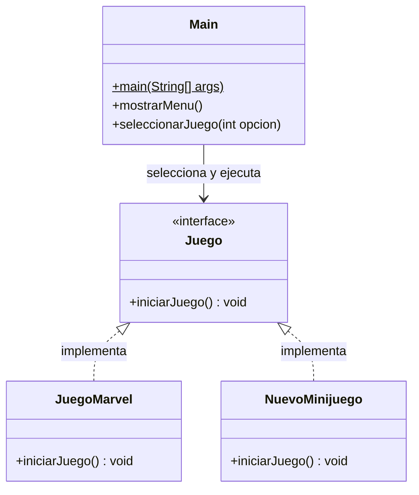

# 🦸 MarvelDle — Adivina el Personaje de Marvel

<div align="center">

**Un juego de adivinanzas por consola inspirado en [Wordle](https://www.nytimes.com/games/wordle), pero con personajes del Universo Cinematográfico de Marvel (MCU).**


</div>

---

## 📖 ¿De qué va el proyecto?

**MarvelDle** es un minijuego de consola desarrollado en Java como proyecto de 1º DAW. El programa selecciona aleatoriamente un personaje secreto de una base de datos de **20 personajes del MCU** y el jugador debe adivinarlo introduciendo nombres.

Tras cada intento, el juego muestra **pistas visuales** para cada atributo del personaje:

| Pista | Significado |
|:-----:|-------------|
| ✅ | El atributo coincide con el personaje secreto |
| ❌ | El atributo **no** coincide |
| ⬆️ | El año de aparición del personaje secreto es **más reciente** |
| ⬇️ | El año de aparición del personaje secreto es **más antiguo** |

### 🎮 Atributos comparados

Cada intento compara **5 atributos** entre el personaje introducido y el secreto:

- **Género** — Hombre / Mujer
- **Tipo** — Héroe / Villano
- **Especie** — Humano, Dios, Titán, Androide, etc.
- **Origen** — Tierra, Asgard, Titán, etc.
- **Año de aparición** — Año de debut en el MCU (con flechas direccionales)

### 🕹️ Ejemplo de partida

```
=====================================
   🦸‍♂️ BIENVENIDO A MARVEL-DLE 🦸‍♀️
=====================================
Se ha elegido un personaje secreto de la base de datos.
Base de datos cargada con: 20 personajes.
Pistas: ✅ (Correcto) | ❌ (Incorrecto) | ⬆️ ⬇️ (Aparicion mayor/menor)

Introduce un nombre de personaje:
> Iron Man

Analizando a Iron Man...
Género: ✅ | Tipo (Héroe/Villano): ✅ | Especie: ✅ | Origen: ✅ | Año: ⬆️ (El personaje es más reciente)

Introduce un nombre de personaje:
> Spider-Man

Analizando a Spider-Man...
Género: ✅ | Tipo (Héroe/Villano): ✅ | Especie: ✅ | Origen: ✅ | Año: ✅

🎉 ¡BRUTAL! Has acertado. El personaje era Spider-Man
🎉 Has hecho 2 intentos.
```

### 🗂️ Base de datos de personajes

El juego incluye **20 personajes** del MCU organizados en un archivo JSON:

| Personaje | Tipo | Especie | Afiliación |
|-----------|------|---------|------------|
| Iron Man | Héroe | Humano | Vengadores |
| Thor | Héroe | Dios | Vengadores |
| Thanos | Villano | Titán | Ninguna |
| Spider-Man | Héroe | Humano | Vengadores |
| Loki | Villano | Gigante de Hielo | Ninguna |
| Doctor Strange | Héroe | Humano | Maestros de las Artes Místicas |
| Groot | Héroe | Flora colossus | Guardianes de la Galaxia |
| Ultron | Villano | Inteligencia Artificial | Ninguna |
| ... | ... | ... | ... |

---

## 🔧 Sección Técnica

### Requisitos previos

- **Java JDK 25** o superior
- **Apache Maven** instalado y configurado en el PATH

### Instalación y ejecución

```bash
# 1. Clonar el repositorio
git clone https://github.com/tu-usuario/Proyecto-Java-1-DAW.git
cd Proyecto-Java-1-DAW

# 2. Compilar el proyecto
mvn compile

# 3. Ejecutar el juego
mvn exec:java -Dexec.mainClass="org.example.MarvelDle.Main"
```

---

### 📁 Estructura del proyecto

```
Proyecto-Java-1-DAW/
├── pom.xml                         # Configuración Maven + dependencias
├── personajes.json                 # Base de datos de personajes (JSON)
├── guia.md                         # Guía interna de arquitectura
├── README.md                       # Este archivo
└── src/
    └── main/
        └── java/
            └── org/example/MarvelDle/
                ├── Main.java           # Punto de entrada
                ├── JuegoMarvel.java    # Lógica principal del juego
                └── Personaje.java      # Modelo de datos del personaje
```



---

### 🏗️ Diagrama de clases



---

### 🔄 Flujo de ejecución

El siguiente diagrama muestra el flujo completo de una partida desde que el usuario ejecuta la aplicación:



---

### 🔗 Diagrama de dependencias



---


### 📊 Modelo de datos — Personaje

Cada personaje se almacena como un objeto JSON con la siguiente estructura:



```json
{
  "nombre": "Iron Man",
  "genero": "Hombre",
  "tipo": "Héroe",
  "especie": "Humano",
  "origen": "Tierra",
  "afiliacion": "Vengadores",
  "aparicion": 2008
}
```

---

### 🧩 Extensibilidad

El proyecto está diseñado para ser **fácilmente extensible**. Se puede añadir nuevos minijuegos implementando la interfaz `Juego`:


.
Para añadir un nuevo juego:

1. Crear una clase que implemente `iniciarJuego()`
2. Registrarla en el menú principal de `Main`
3. Implementar la lógica del juego internamente

---

### 🛠️ Stack tecnológico

| Tecnología | Versión | Uso |
|------------|---------|-----|
| **Java** | JDK 25 | Lenguaje principal |
| **Maven** | — | Gestión del proyecto y dependencias |
| **Gson** | 2.10.1 | Deserialización del archivo JSON a objetos Java |

---

<div align="center">

*Proyecto desarrollado como parte de 1º DAW — Desarrollo de Aplicaciones Web*

</div>
