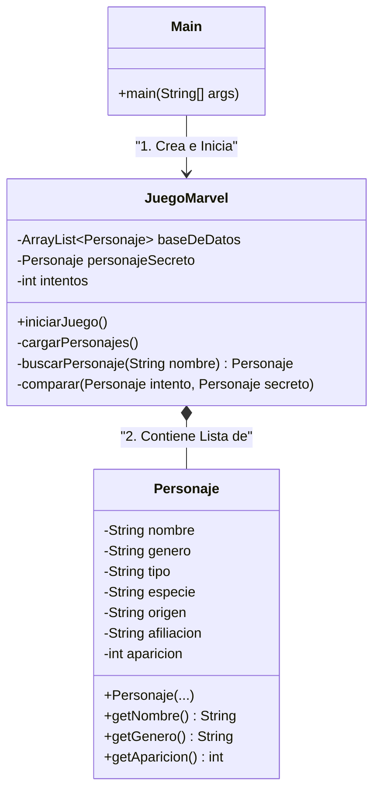

# DIAGRAMA PRINCIPAL

```mermaid
classDiagram
    class Main {
        +main(String[] args)
    }

    class JuegoMarvel {
        -ArrayList~Personaje~ baseDeDatos
        -Personaje personajeSecreto
        -int intentos
        +iniciarJuego()
        -cargarPersonajes()
        -buscarPersonaje(String nombre) Personaje
        -comparar(Personaje intento, Personaje secreto)
    }

    class Personaje {
        -String nombre
        -String genero
        -String tipo
        -String especie
        -String origen
        -String afiliacion
        -int aparicion
        +Personaje(...)
        +getNombre() String
        +getGenero() String
        +getAparicion() int
    }

    Main --> JuegoMarvel : "1. Crea e Inicia"
    JuegoMarvel *-- Personaje : "2. Contiene Lista de"
```
# 
