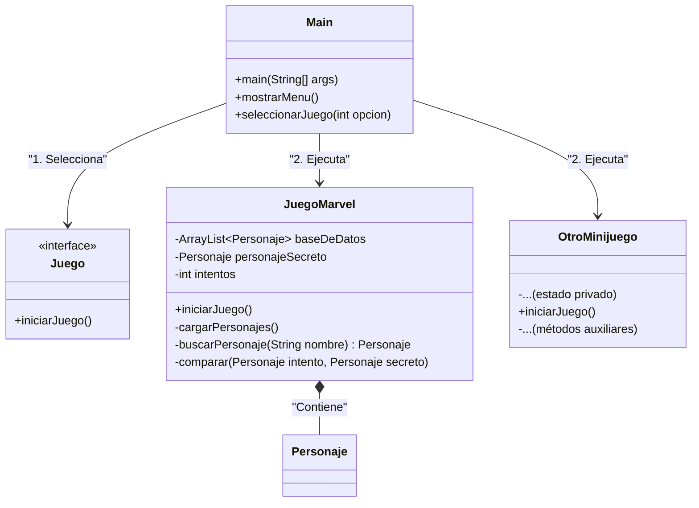

# GUÍA DE LA APLICACIÓN

Esta guía describe la arquitectura general del proyecto y cómo añadir nuevos **minijuegos**. Actualmente hay un juego llamado **MarvelDle**, y se planea un menú donde el usuario pueda elegir qué minijuego jugar.

---

## 🧭 Arquitectura general

La aplicación está diseñada para tener un **punto de entrada principal** (`Main`) que muestra un **menú de selección de minijuegos** y luego delega la lógica a cada clase de juego.

Cada minijuego puede implementar una interfaz común (por ejemplo, `Juego`) para facilitar la extensión y el manejo desde el menú.

### 💡 Diagrama principal


---

## ✅ Cómo agregar un nuevo minijuego

1. **Crear una nueva clase** que implemente `Juego` (o comparta la convención de `iniciarJuego()`).
2. Añadir un **caso en el menú** en `Main` para que el usuario pueda elegirlo.
3. Implementar la lógica del juego dentro de `iniciarJuego()`.

> Ejemplo de esqueleto de clase:
>
> ```java
> public class MiNuevoJuego implements Juego {
>     @Override
>     public void iniciarJuego() {
>         // Lógica del minijuego
>     }
> }
> ```

---

## 🧩 Cómo funciona el menú de selección

- `Main` muestra las opciones disponibles (MarvelDle + otros minijuegos).
- El usuario elige un número.
- `Main` instancia y ejecuta el minijuego elegido.

---

## 📌 Recomendaciones

- Mantén cada minijuego **autónomo** y **fácil de testear**.
- Usa **clases adicionales** (como `Personaje`) solo cuando compartas datos complejos.
- Si tienes más de 3 minijuegos, considera separar el menú en un gestor de juegos (por ejemplo, `GestorDeMinijuegos`).
